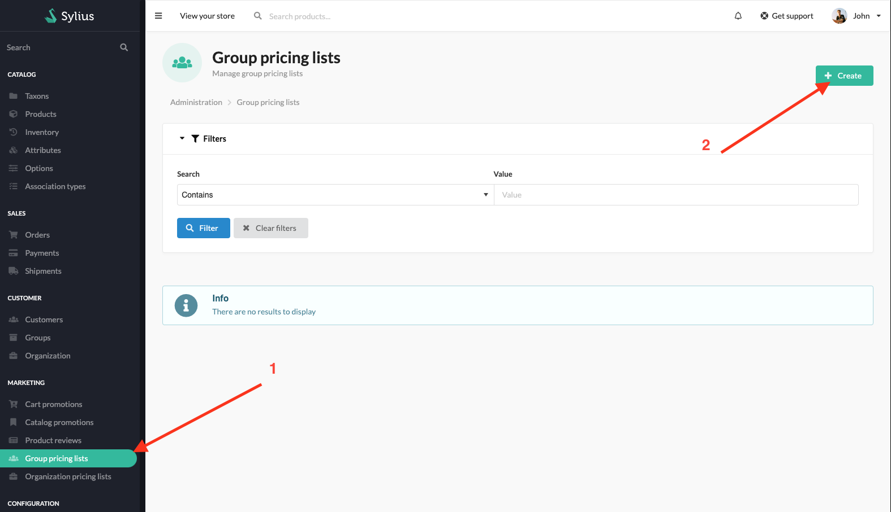

## SyliusB2BPlugin

SyliusB2BPlugin is a dedicated B2B solution. It's a bundle of already configured features that allows you to quickly build B2B experience.

More details about features can be found [here](../functionalities.md)

---

### Customer Groups Pricing Lists

Allows creating pricing lists for customer groups. Administrator can create pricing lists for specific customer groups, add products and set prices for them. Logged in customer from selected group will see the prices from the pricing list instead of the default prices.

---

### User Guide

#### Creating fixed price Customer Groups Pricing Lists

Administrators can create fixed pr pricing lists for customer groups

Then fill in customer group pricing list form and choose product variants. Set new price for each product variant

After saving the form, you can see all pricing lists

#### Creating percentage Customer Groups Pricing Lists

Administrators can create percentage pricing lists for customer groups. Percentage discount is for all products

Then fill in customer group pricing list form and choose percentage discount

After saving the form, you can see all pricing lists

#### Using Customer group pricing list

When customer is logged in and is a member of a given customer group, they can see new prices for products instead of default prices

