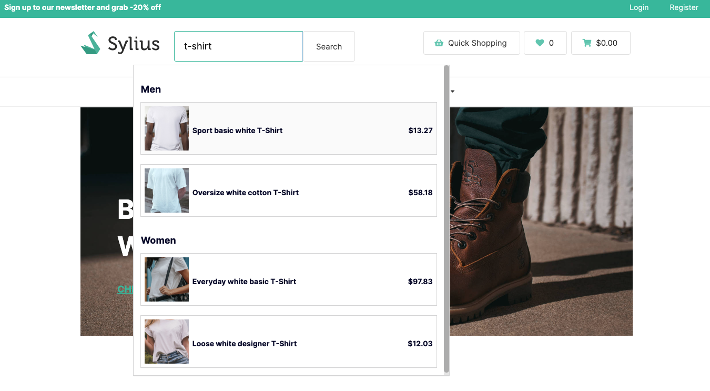
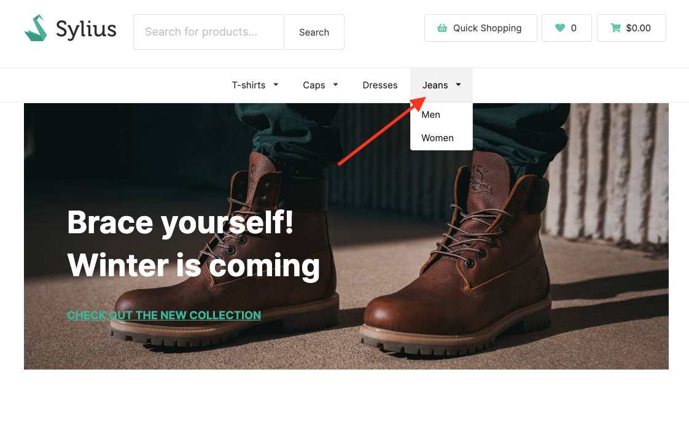
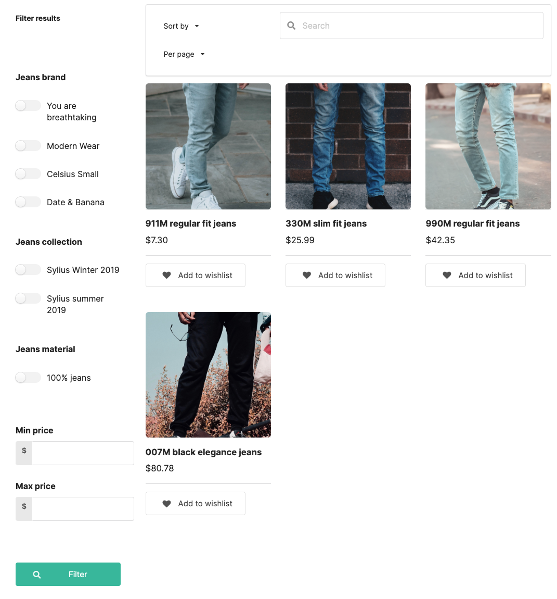
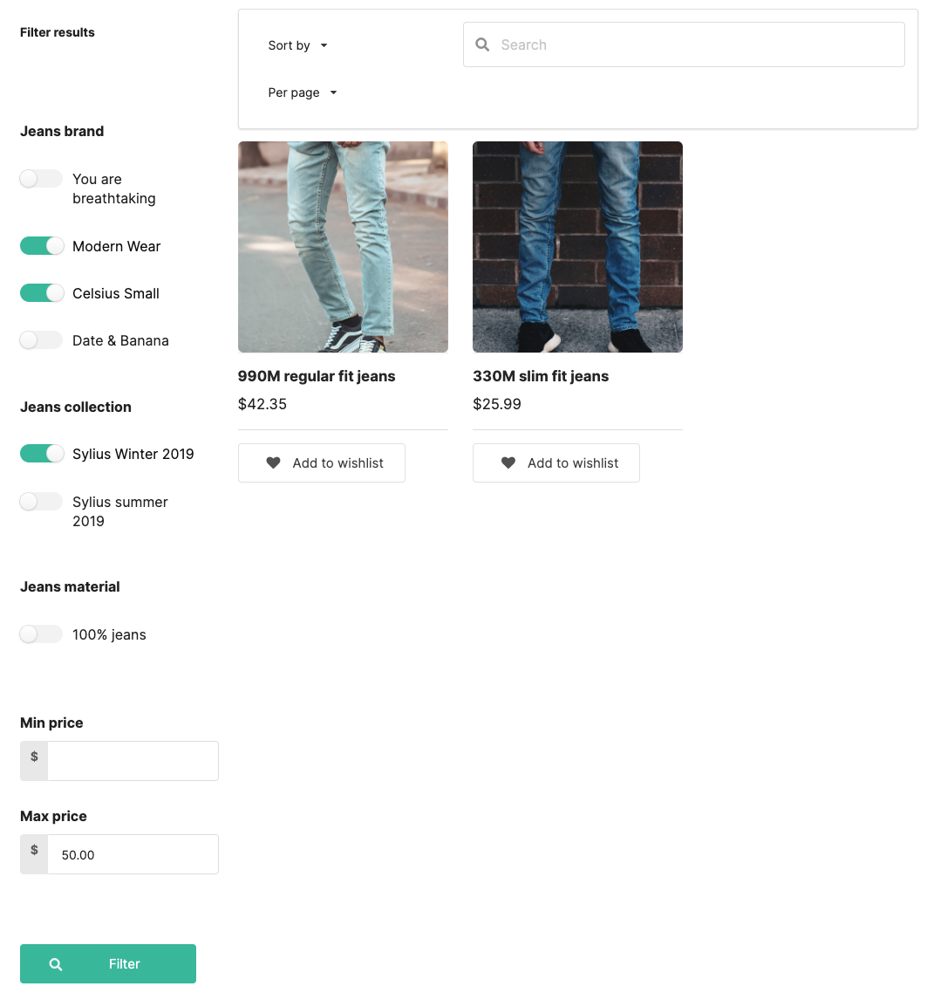

## B2B Kit

B2B Kit is a dedicated B2B solution. It's a bundle of already configured features that allows you to quickly build B2B experience.

More details about features can be found [here](../functionalities.md)

---

### ElasticSearch

ElasicSearch feature allows you to search and filter products by options, attributes, taxons and name. It totally replaces the default Sylius shop search.

---

### User Guide

#### Searching for products

To search for products, you need to start typing the desired phrase in the search bar. The search results will be displayed in a dropdown.

#### Filtering and sorting products

Filtering and sorting products is possible on the product listing page.

You can filter products by: options, attributes, taxons and name. You can also sort products by: bestsellers, newest and price. Moreover, choose the number of products per page.

After filtering and sorting products, you can see the results.

