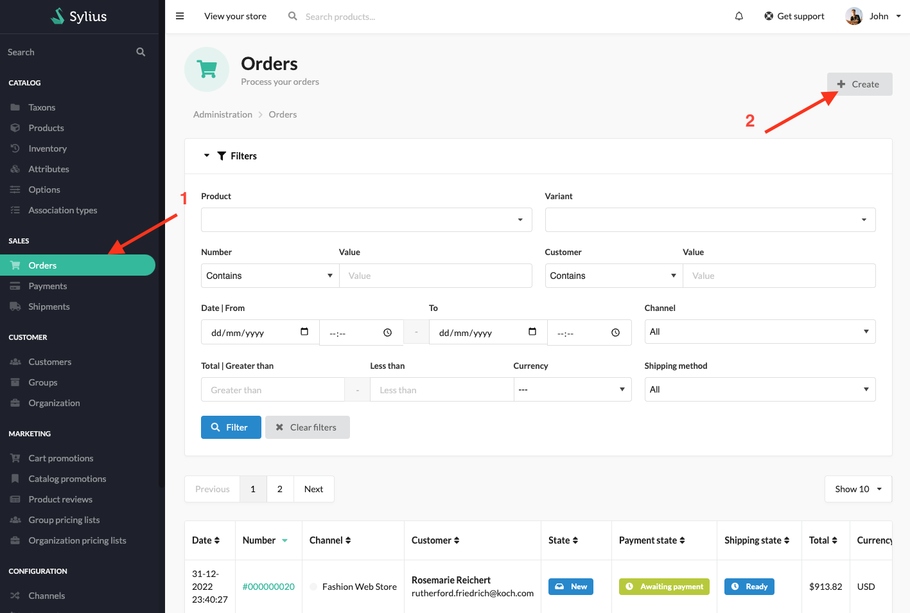
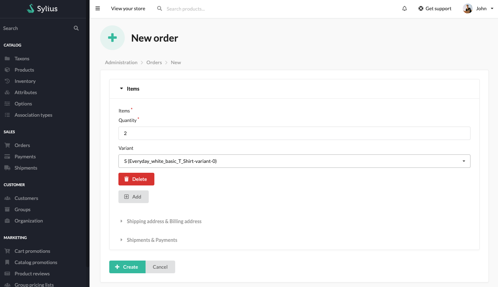
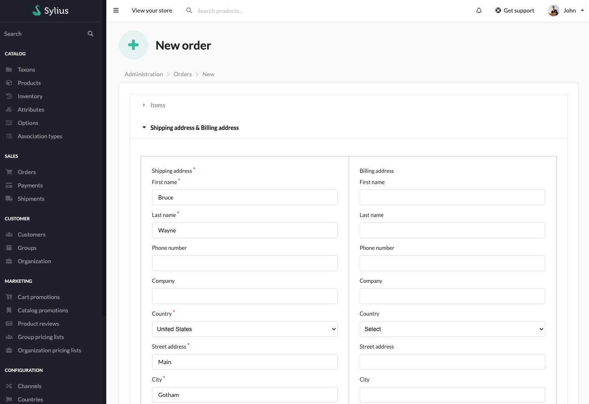
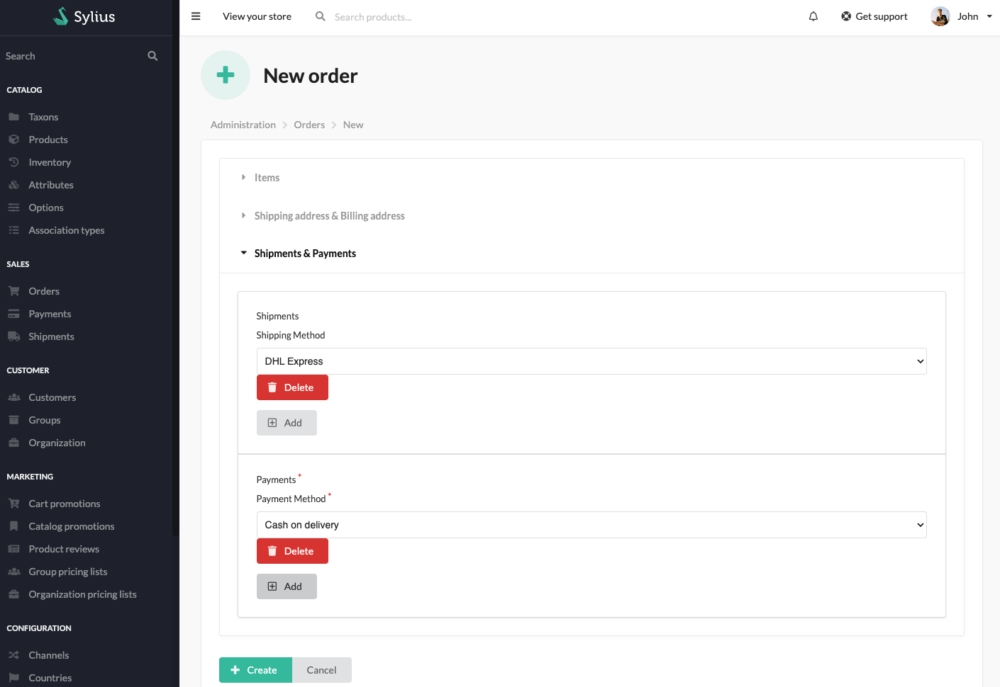
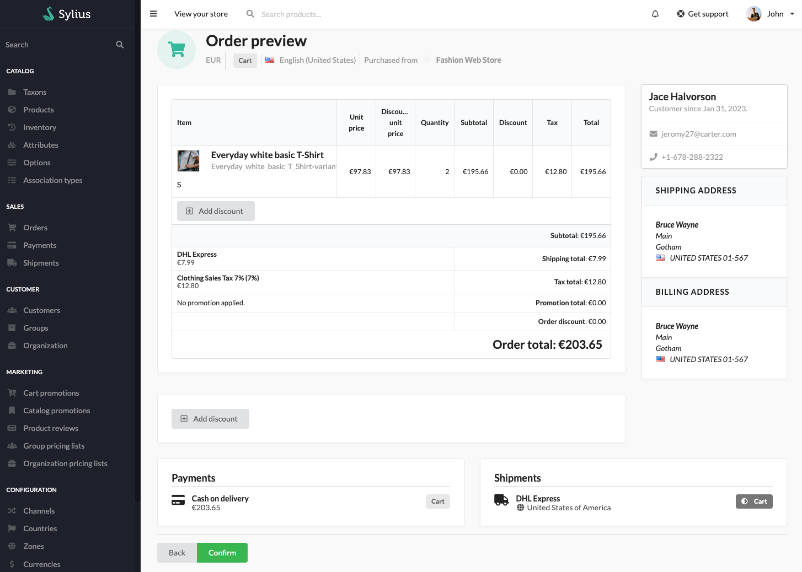
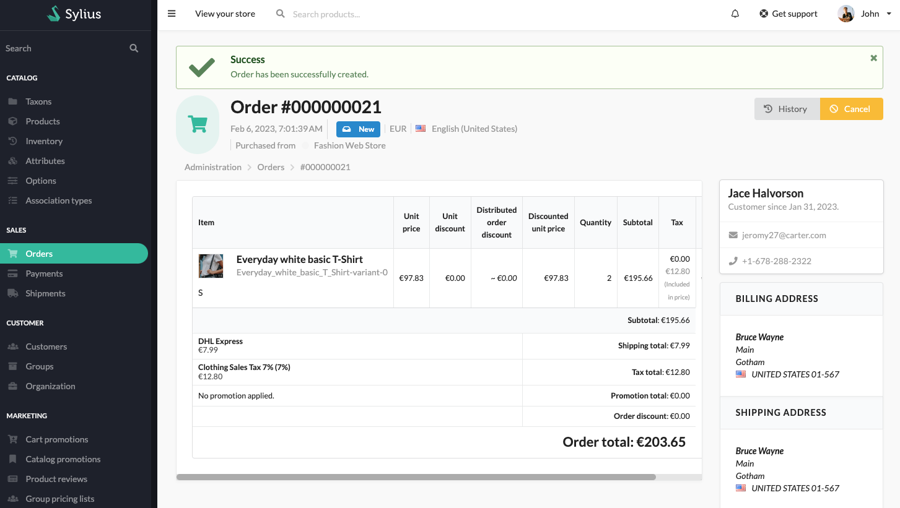
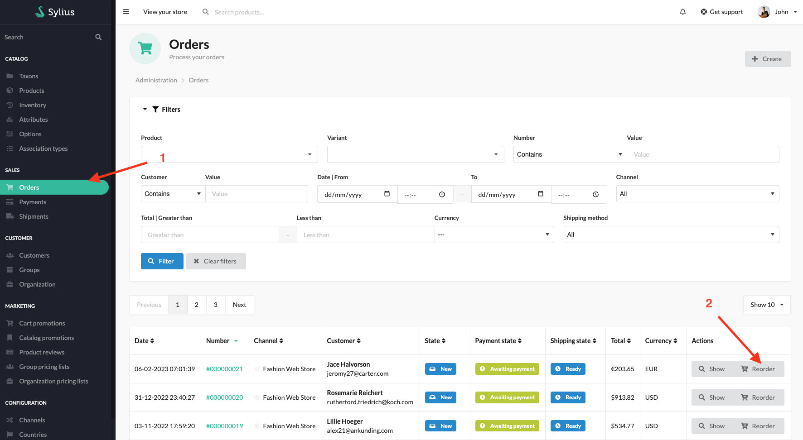

## Sylius B2B Kit

Sylius B2B Kit is a dedicated B2B solution. It's a bundle of already configured features that allows you to quickly build B2B experience.

More details about features can be found [here](../functionalities.md)

---

### Order Management

Allows creating and managing customer orders in the admin panel. Administrator can create or change / reorder orders for customers.

---

### User Guide

#### Creating an Order in Admin Panel

To create an order, click on the "Create" button in the Orders list

Then fill in the form with customer email then click next

Fill in the form with product variants and quantities

Fill in the form with shipping and billing address

Choose shipping and payment method, then click "Create"

Check the order preview and click "Confirm"

After creating order, you can see new order details

#### Reordering in Admin Panel

To reorder, click on the "Reorder" button in the Orders list

Change the values that need to be corrected (eg. product variants and quantities, shipping and billing address, etc.)

After going through above-mentioned steps click "Create", then check the order preview and click "Confirm"

After reordering, new order for selected customer will be created. You can see new order details

