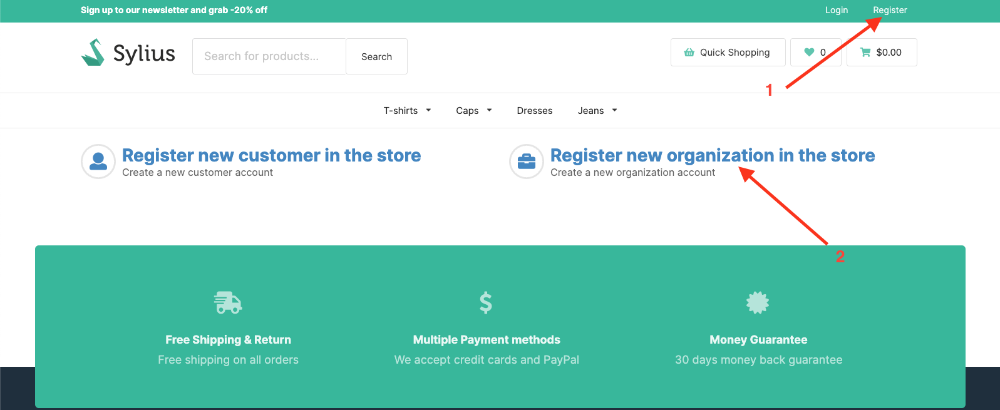
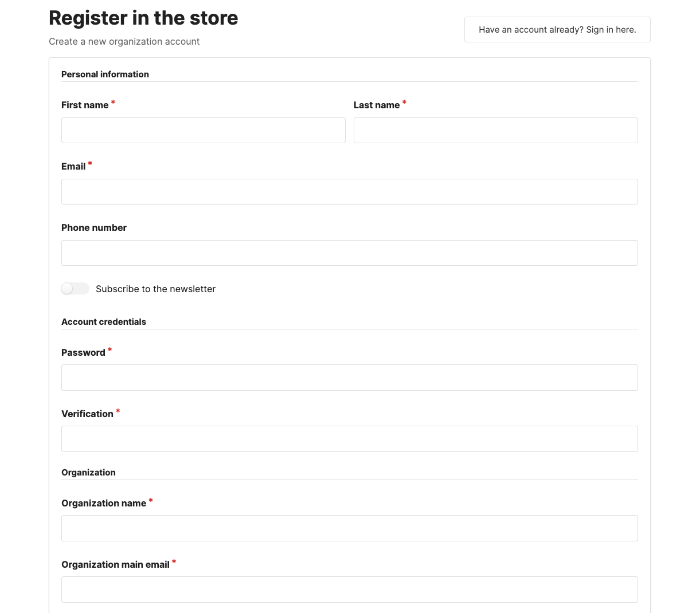
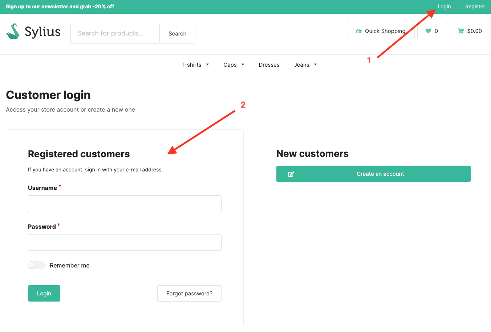
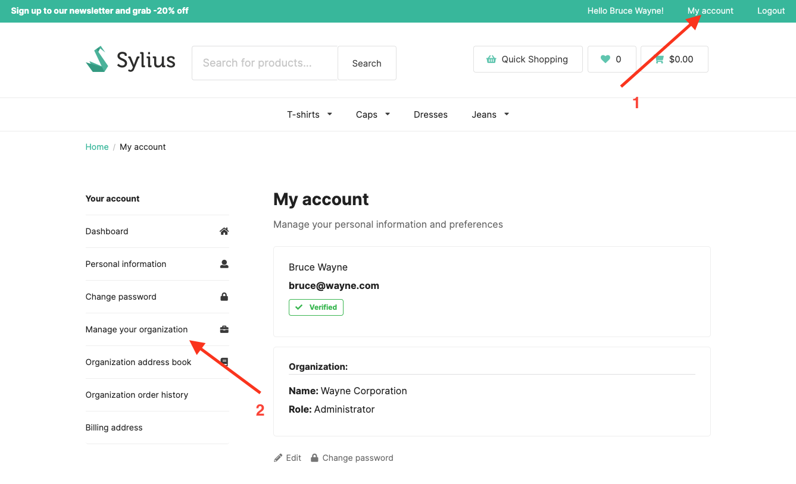
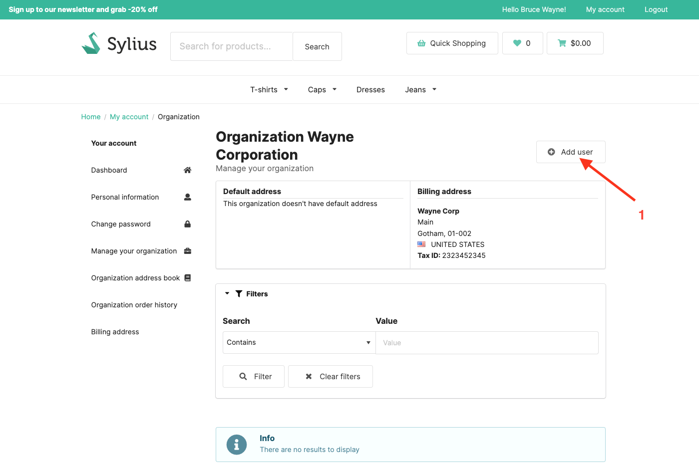
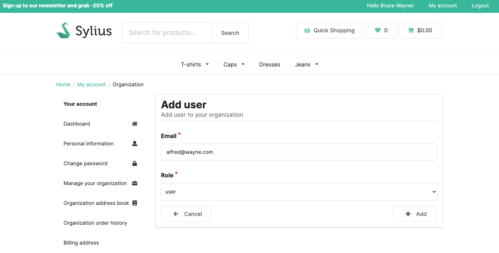
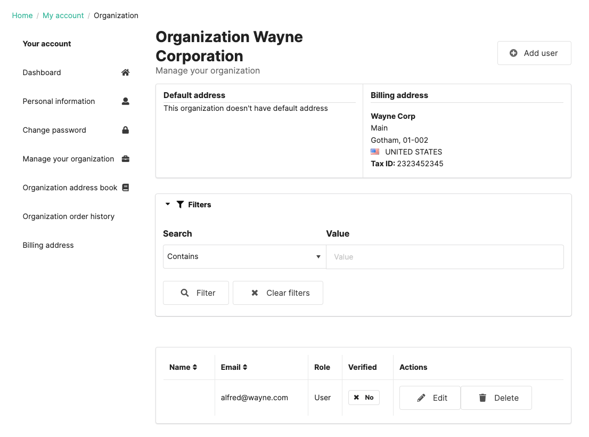
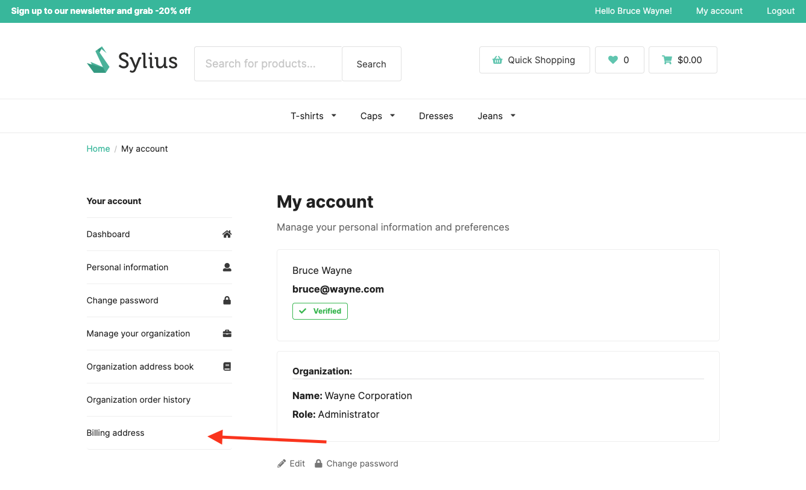
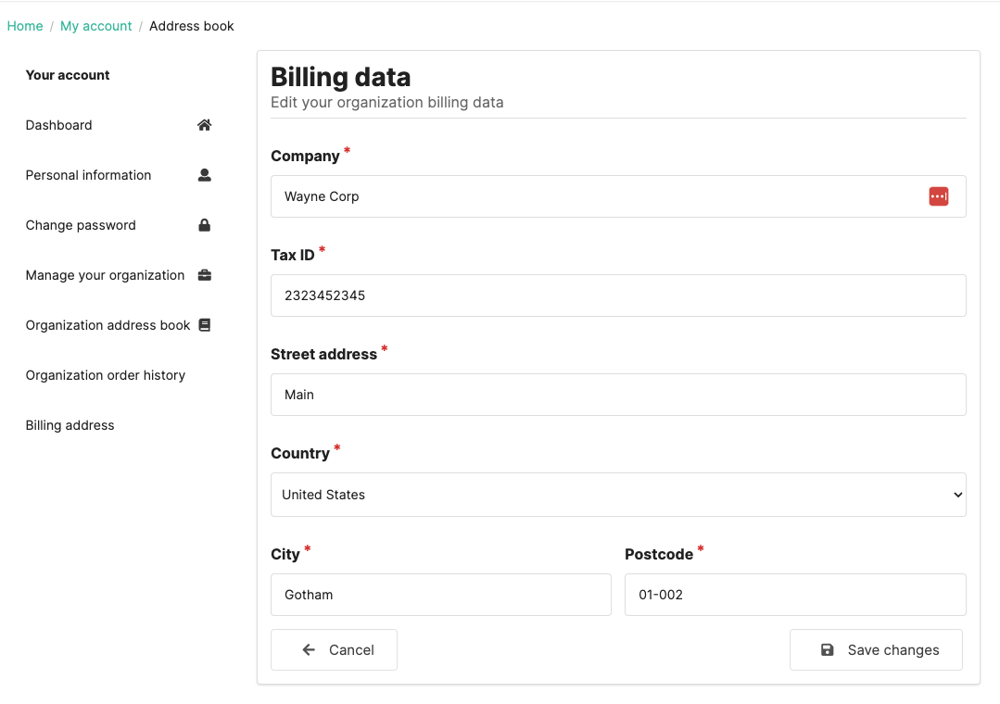

## Sylius B2B Kit

Sylius B2B Kit is a dedicated B2B solution. It's a bundle of already configured features that allows you to quickly build B2B experience.

More details about features can be found [here](../functionalities.md)

---

### Organization Management

Allows creating organization account which shares the same billing data, address book and order history. It allows to add roles for members of organization to allow/deny certain action (eg. admin can only add new customer to organization and change billing data).

---

### User Guide

#### Creating an Organization Account

In order to create an organization account, you need to go to the registration page and select the "Organization" option.

Fill in the registration form and click "Create an account" button. After that, your organization account will be created.

#### Managing Organization Users

In order to manage organization users, you have to be organization administrator. Log in to your organization admin account.

Go to "My account" and select "Manage your organization" option in the menu.

You can add new users to your organization by clicking "Add user" button.

Add your new user email and select his role. Submit the form by clicking "Add" button

You will see the new user in the list. You can also edit or remove users in your organization.

#### Edit Organization Billing Address

Only organization administrator can edit organization billing address. To do that, go to "My account" and select "Billing address" option in the menu.

Edit the billing address and submit the form by clicking "Save changes" button

