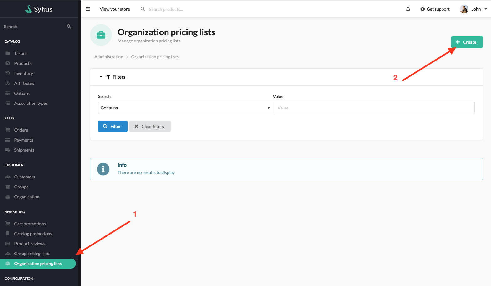
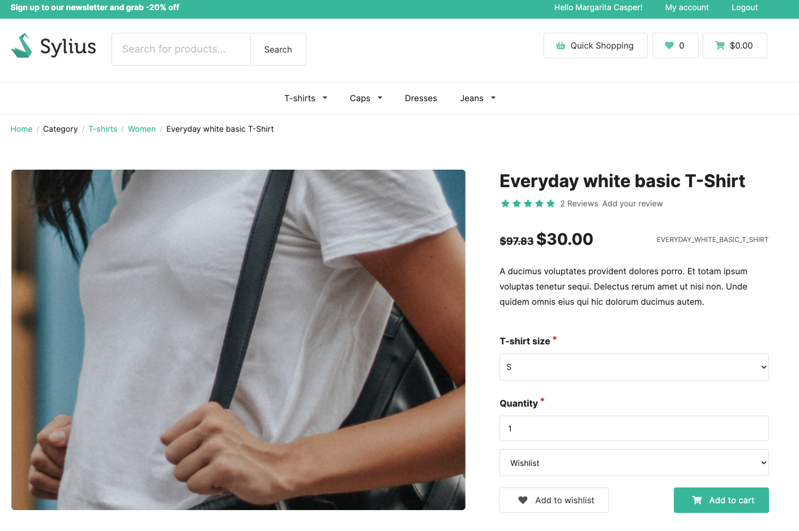

## Sylius B2B Kit

Sylius B2B Kit is a dedicated B2B solution. It's a bundle of already configured features that allows you to quickly build B2B experience.

More details about features can be found [here](../functionalities.md)

---

### Customer Groups Pricing Lists

Allows creating pricing lists for organization. Administrator can create pricing lists for specific organization, add products and set prices for them. Organization user will see the prices from the pricing list instead of the default prices.

---

### User Guide

#### Creating Organization pricing list

Administrators can create pricing lists for organizations

Then fill in organization pricing list form and choose product variants and set new price for each product variant

After saving the form, you can see all pricing lists

#### Using Organization group pricing list

When customer is logged in and is a member of a given organization, they can see new prices for products instead of default prices

