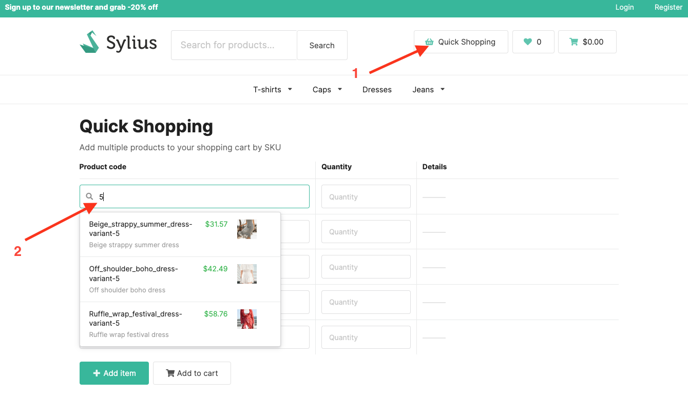
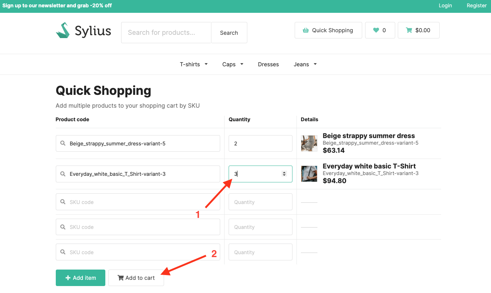
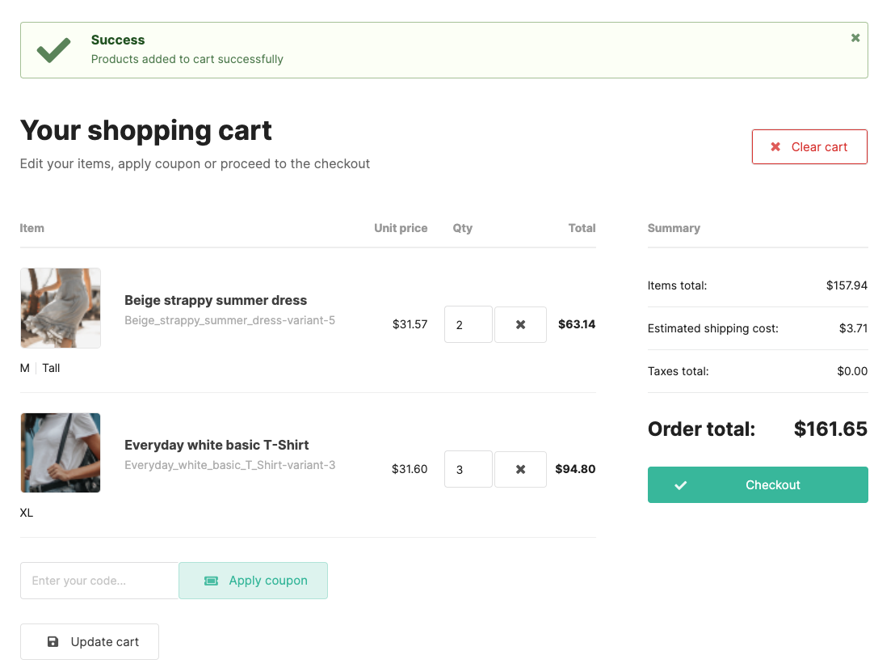

## Sylius B2B Kit

Sylius B2B Kit is a dedicated B2B solution. It's a bundle of already configured features that allows you to quickly build B2B experience.

More details about features can be found [here](../functionalities.md)

---

### QuickShopping

Allows adding multiple products to the cart at once, using product codes. You can easily and quickly add large number of products to the cart.

---

### User Guide

#### QuickShopping

In order to add products to the cart, click on the "Quick Shopping" button. Then fill in the form with product codes and quantities.

You can add multiple products at once - change quantities as on the screen below. Then click on the "Add to cart" button.

After adding products to the cart, you will be redirected to the cart.

