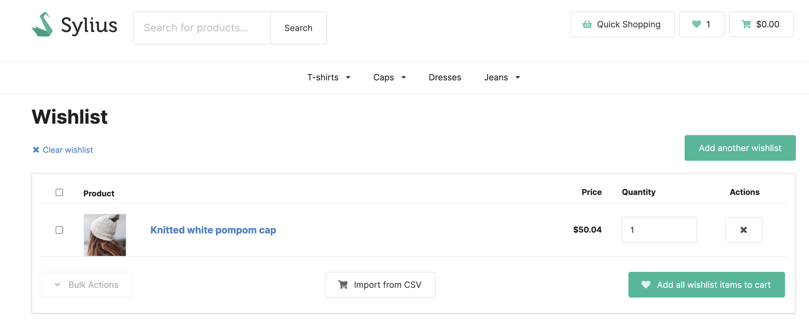

## Sylius B2B Kit

Sylius B2B Kit is a dedicated B2B solution. It's a bundle of already configured features that allows you to quickly build B2B experience.

More details about features can be found [here](../functionalities.md)

---

### Wishlists

Integrates wishlist features in your shop. Allows creating multiple wishlists by shop users and not logged customers. Adding products to wishlist is very easy and quick. That enables also adding all the products directly from the wishlist to the cart

---

### User Guide

#### Using single wishlist

In order to add products to wishlist, click on the "Add to wishlist" button. Then you can check your wishlist by clicking on the "Heart" button.

You can also add products to wishlist from product details page.

After adding products to the wishlist, you can see, manage and add them to the cart.

#### Adding another wishlist

In order to add another wishlist, click on the "Add another wishlist" button.

Fill in the wishlist name and click on the "Perform" button.

In the wishlist page, you can see multiple wishlists.

To add products to another wishlist, click on the "Add to wishlist" button. Then select desired wishlist.

