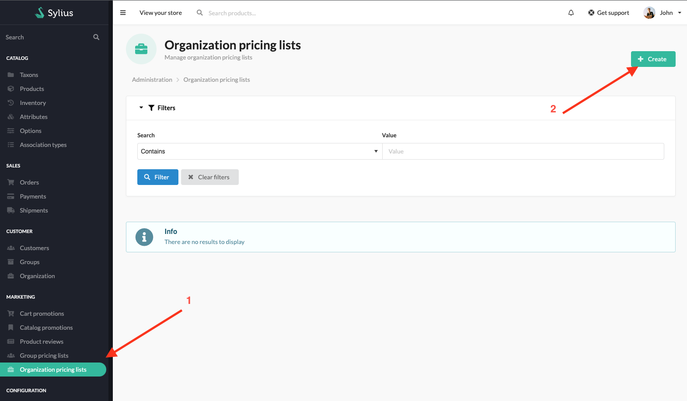
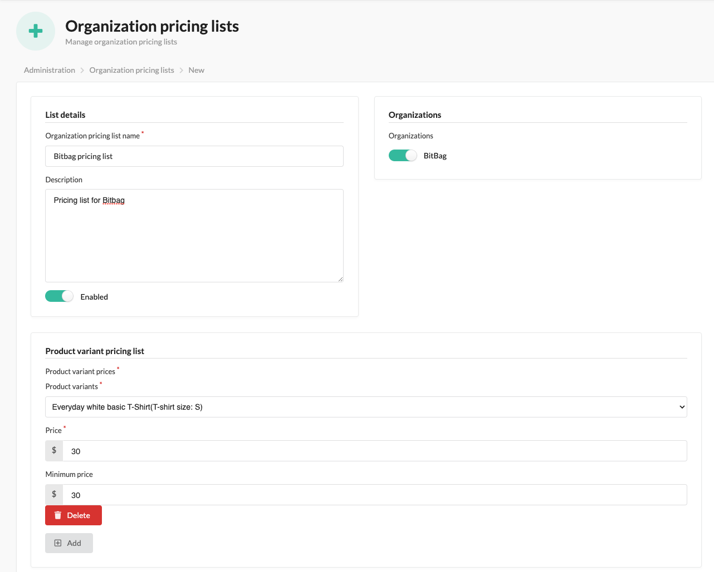
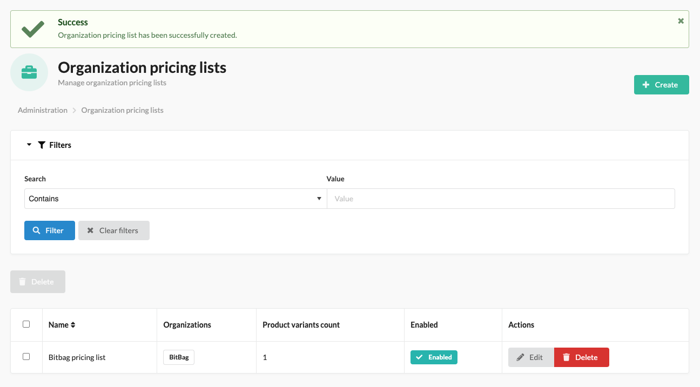

## Creating Organization pricing list

Administrators can create pricing lists for organizations

Then fill up organization pricing list form and choose product variants for pricing list

After saving form, they can see list of pricing lists

## Using Organization group pricing list

When customer is logged in and is a member of an ongranization, they can see new price for products

